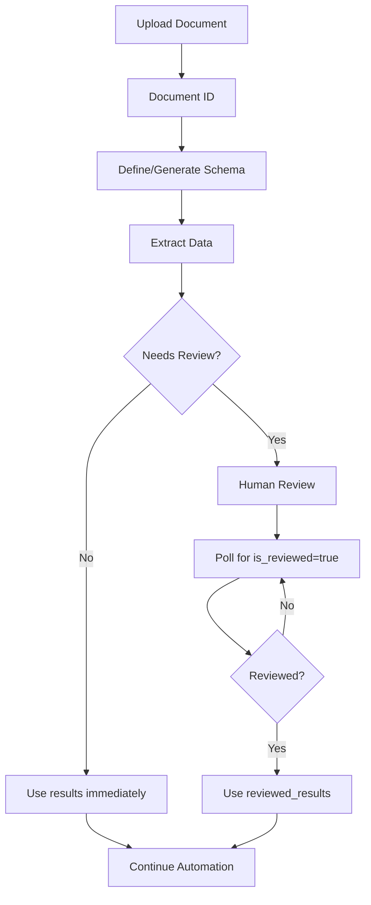

## Complete Extraction Workflow

Understanding the full extraction lifecycle helps you build robust automation pipelines. Here's how documents flow through the system:



## Phase 1: Document Upload

<Steps>
<Step title="Upload Files">
  Submit documents via `POST /upload`. Supports batching up to 100 files.
  
  ```python
  document_ids = upload_documents(["invoice1.pdf", "invoice2.pdf"])
  # Returns: ["uuid1", "uuid2"]
  ```
  
  **Credit Impact**: No credits charged for upload  
  **Storage**: Documents stored for 30 days
</Step>

<Step title="Receive Document IDs">
  Store the returned UUIDs for extraction requests.
  
  ```python
  # Map filenames to IDs for tracking
  doc_mapping = {
      "invoice1.pdf": "uuid1",
      "invoice2.pdf": "uuid2"
  }
  ```
</Step>
</Steps>

## Phase 2: Schema Definition

Choose one of three approaches:

<Tabs>
<Tab title="Predefined Schema">
  Use built-in templates for common document types:
  
  ```python
  # Built-in invoice schema
  schema = get_predefined_schema("invoice")
  ```
  
  ✓ Fastest setup  
  ✓ Proven accuracy  
  ✗ Limited customization
</Tab>

<Tab title="Custom Schema">
  Define your own schema for unique documents:
  
  ```python
  schema = {
      "named_entities": {
          "policy_number": {
              "type": "string",
              "description": "Insurance policy number"
          },
          "coverage_amount": {
              "type": "number",
              "description": "Total coverage in USD"
          }
      },
      "required": ["policy_number"]
  }
  ```
  
  ✓ Fully customizable  
  ✓ Matches your exact needs  
  ✗ Requires domain knowledge
</Tab>

<Tab title="Generated Schema">
  Auto-generate from a sample document:
  
  ```python
  # Upload sample
  sample_id = upload_documents(["sample_policy.pdf"])[0]
  
  # Generate schema
  response = generate_schema(sample_id)
  schema = response["schema"]
  ```
  
  ✓ Quick start  
  ✓ Learns from your docs  
  ✗ May need refinement
</Tab>
</Tabs>

## Phase 3: Data Extraction

Configure extraction mode based on requirements:

### Mode Selection Decision Tree

```
Start
  ├─ Need confidence scores? ──No──> Basic Extraction
  │                                   (2-6 credits/page)
  │
  └─ Yes
      ├─ Scanned/Image documents? ──Yes──> VLM Extraction
      │                                     (10 credits/page)
      │
      └─ No (Native PDF/Text)
          └─ Critical accuracy needed? ──Yes──> Advanced Extraction
                                                  (15 credits/page)
```

### Basic Extraction Example

```python
result = extract_data(
    document_id=document_id,
    schema=schema,
    model="openai-gpt-4.1",  # or "google-gemini-2.0-flash"
    prompt="Extract all invoice fields accurately"
)

# No confidence scores, no review flagging
if result["needs_review"]:  # Always False for Basic mode
    pass
else:
    process_data(result["results"])
```

### Advanced Extraction Example

```python
result = extract_data(
    document_id=document_id,
    schema=schema,
    # Advanced mode - no model or extraction_mode
    review_threshold=85,
    prompt="Extract invoice with high accuracy"
)

# Includes confidence scores
if result["needs_review"]:
    # Some required fields below threshold
    print("⚠️  Needs human review")
    # Proceed to Phase 4
else:
    # All required fields above threshold
    process_data(result["results"])
```

**Credit Usage**: Credits deducted per page × model cost

## Phase 4: Review Workflow

Only triggered when `needs_review = true`:

<Steps>
<Step title="Identify Flagged Fields">
  Parse the metadata to find low-confidence fields:
  
  ```python
  for field, flag in result["needs_review_metadata"]["review_flags"].items():
      if flag:
          confidence = result["needs_review_metadata"]["confidence_scores"][field]
          print(f"⚠️  {field}: {confidence}% confidence")
  ```
</Step>

<Step title="Notify Review Team">
  Alert human reviewers through your preferred channel:
  
  ```python
  # Email notification
  send_email(
      to="reviewers@company.com",
      subject=f"Review Needed: {filename}",
      body=f"Document {document_id} has {len(flagged_fields)} fields needing review"
  )
  
  # Or webhook
  notify_slack(f"New review: {document_id}")
  ```
</Step>

<Step title="Poll for Completion">
  Implement polling to detect when `is_reviewed = true`:
  
  ```python
  reviewed_data = poll_for_review(
      document_id=document_id,
      poll_interval=10,    # Check every 10 seconds
      timeout=600          # Give up after 10 minutes
  )
  
  if reviewed_data:
      process_data(reviewed_data)
  else:
      handle_timeout(document_id)
  ```
  
  See [Polling Pattern](/api/review/polling-pattern) for details.
</Step>

<Step title="Use Reviewed Results">
  Once `is_reviewed = true`, use `reviewed_results` instead of `results`:
  
  ```python
  extraction = get_extraction(document_id)
  
  if extraction["is_reviewed"]:
      # Use human-corrected data
      data = extraction["reviewed_results"]
  else:
      # Use original AI extraction
      data = extraction["results"]
  ```
</Step>
</Steps>

## Phase 5: Data Processing

Process the final data in your automation:

```python
def process_invoice_data(data):
    """Process extracted/reviewed invoice data."""
    
    # Validate required fields
    assert "invoice_number" in data
    assert "total_amount" in data
    
    # Update your system
    create_accounting_record(
        invoice_number=data["invoice_number"],
        amount=data["total_amount"],
        vendor=data.get("vendor_name"),
        line_items=data.get("line_items", [])
    )
    
    # Archive original document
    archive_document(data["document_id"])
    
    return True
```

## Complete Example

Here's a full workflow implementation:

```python
import requests
import time
from typing import Dict, Optional

class DocumindWorkflow:
    """Complete extraction workflow manager."""
    
    def __init__(self, api_key: str):
        self.api_key = api_key
        self.base_url = "https://api.documind.com/api/v1"
        self.headers = {"X-API-Key": api_key}
    
    def process_document(
        self,
        file_path: str,
        schema: Dict,
        mode: str = "advanced"
    ) -> Dict:
        """
        Complete workflow: upload → extract → review → process
        
        Args:
            file_path: Path to document file
            schema: Extraction schema
            mode: 'basic', 'vlm', or 'advanced'
        
        Returns:
            Final extracted data (original or reviewed)
        """
        # Phase 1: Upload
        print(f"📤 Uploading {file_path}...")
        doc_id = self._upload(file_path)
        print(f"✓ Uploaded: {doc_id}")
        
        # Phase 2 & 3: Extract
        print(f"🔍 Extracting data ({mode} mode)...")
        result = self._extract(doc_id, schema, mode)
        print(f"✓ Extraction complete")
        
        # Phase 4: Handle review if needed
        if result["needs_review"]:
            print(f"⚠️  Document needs review")
            flagged = self._count_flagged_fields(result["needs_review_metadata"])
            print(f"   {flagged} field(s) flagged")
            
            # Poll for review
            print(f"⏳ Waiting for human review...")
            reviewed = self._poll_review(doc_id, timeout=600)
            
            if reviewed:
                print(f"✓ Review completed")
                return reviewed
            else:
                print(f"❌ Review timeout")
                raise TimeoutError("Review not completed in time")
        else:
            print(f"✓ No review needed")
            return result["results"]
    
    def _upload(self, file_path: str) -> str:
        """Upload document and return ID."""
        with open(file_path, "rb") as f:
            response = requests.post(
                f"{self.base_url}/upload",
                headers=self.headers,
                files={"files": f}
            )
        response.raise_for_status()
        return response.json()[0]
    
    def _extract(self, doc_id: str, schema: Dict, mode: str) -> Dict:
        """Extract data from document."""
        config = {"schema": schema, "prompt": "Extract all data accurately"}
        
        if mode == "basic":
            config["model"] = "openai-gpt-4.1"
        elif mode == "vlm":
            config["extraction_mode"] = "vlm"
            config["review_threshold"] = 80
        else:  # advanced - no model or extraction_mode
            config["review_threshold"] = 85
        
        response = requests.post(
            f"{self.base_url}/extract/{doc_id}",
            headers={**self.headers, "Content-Type": "application/json"},
            json=config
        )
        response.raise_for_status()
        return response.json()
    
    def _poll_review(
        self,
        doc_id: str,
        timeout: int = 600,
        poll_interval: int = 10
    ) -> Optional[Dict]:
        """Poll until review is complete."""
        start = time.time()
        
        while (time.time() - start) < timeout:
            response = requests.get(
                f"{self.base_url}/data/extractions",
                headers=self.headers,
                params={"document_id": doc_id, "limit": 1}
            )
            
            data = response.json()
            if data["items"] and data["items"][0]["is_reviewed"]:
                return data["items"][0]["reviewed_results"]
            
            time.sleep(poll_interval)
        
        return None
    
    def _count_flagged_fields(self, metadata: Dict) -> int:
        """Count fields flagged for review."""
        count = 0
        flags = metadata.get("review_flags", {})
        
        def count_recursive(obj):
            nonlocal count
            if isinstance(obj, bool):
                if obj:
                    count += 1
            elif isinstance(obj, dict):
                for v in obj.values():
                    count_recursive(v)
        
        count_recursive(flags)
        return count

# Usage
workflow = DocumindWorkflow(api_key="your_api_key")

schema = {
    "named_entities": {
        "invoice_number": {"type": "string"},
        "total_amount": {"type": "number"}
    },
    "required": ["invoice_number", "total_amount"]
}

# Process document through complete workflow
try:
    data = workflow.process_document(
        file_path="invoice.pdf",
        schema=schema,
        mode="advanced"
    )
    
    print(f"✓ Final data: {data}")
    process_invoice(data)
    
except TimeoutError:
    print("Review took too long, escalating...")
except Exception as e:
    print(f"Error: {e}")
```

## Troubleshooting

<AccordionGroup>
<Accordion title="Upload Fails">
  **Problem**: `500 Internal Server Error` on upload
  
  **Solutions**:
  - Verify file is not corrupted
  - Check file size < 50MB
  - Ensure file format is supported
  - Retry with exponential backoff
</Accordion>

<Accordion title="Extraction Timeout">
  **Problem**: Extraction takes too long or times out
  
  **Solutions**:
  - Switch to Basic mode for faster processing
  - Reduce document page count
  - Simplify schema (fewer fields)
  - Contact support if issue persists
</Accordion>

<Accordion title="All Extractions Need Review">
  **Problem**: Review threshold too strict
  
  **Solutions**:
  - Lower `review_threshold` from 85 to 75
  - Mark fewer fields as `required`
  - Improve schema descriptions
  - Use Basic mode if reviews aren't needed
</Accordion>

<Accordion title="Reviews Never Complete">
  **Problem**: Polling times out waiting for review
  
  **Solutions**:
  - Increase timeout to match your review SLA
  - Implement email notifications to reviewers
  - Check review queue isn't backlogged
  - Consider async processing instead of blocking
</Accordion>
</AccordionGroup>

## Next Steps

<CardGroup cols={2}>
<Card title="Upload Documents" icon="upload" href="/api/extraction/upload-documents">
  Detailed upload endpoint documentation
</Card>

<Card title="Extract Data" icon="file-export" href="/api/extraction/extract-data">
  Complete extraction API reference
</Card>

<Card title="Polling Pattern" icon="rotate" href="/api/review/polling-pattern">
  Robust polling implementation guide
</Card>

<Card title="Automation Patterns" icon="diagram-project" href="/api/patterns/automation-pipeline">
  Production-ready automation examples
</Card>
</CardGroup>

