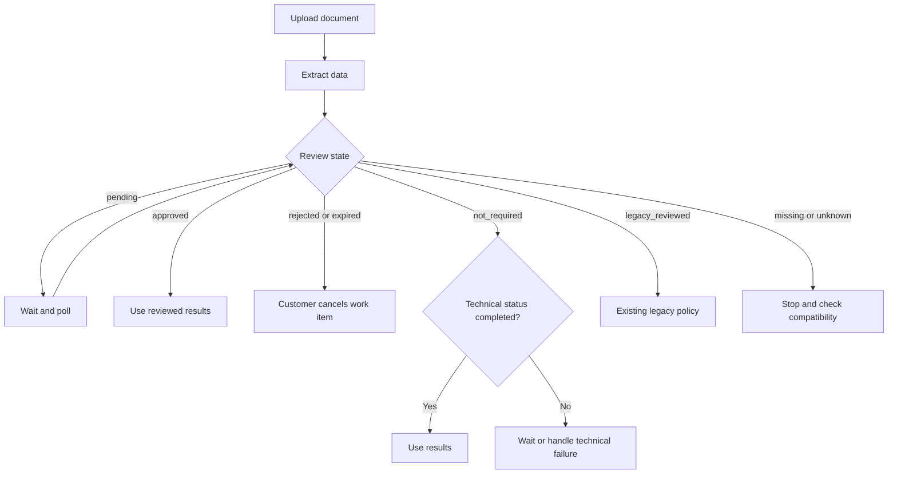

<Warning>Use explicit `review_status` for automation. Rejected and expired documents require customer-owned cancellation. Missing or unknown state must stop processing. Legacy-reviewed records require your existing legacy policy. Older short examples below demonstrate extraction or polling only; use the [complete state dispatcher](/api/review/polling-pattern) for production integration.</Warning>


## Complete Extraction Workflow

Understanding the full extraction lifecycle helps you build robust automation pipelines. Here's how documents flow through the system:


```mermaid
graph TD
    A[Upload document] --> B[Extract data]
    B --> C{Review state}
    C -->|pending| D[Wait and poll]
    D --> C
    C -->|approved| E[Use reviewed results]
    C -->|rejected or expired| F[Customer cancels work item]
    C -->|not_required| G{Technical status completed?}
    G -->|Yes| H[Use results]
    G -->|No| I[Wait or handle technical failure]
    C -->|legacy_reviewed| J[Existing legacy policy]
    C -->|missing or unknown| K[Stop and check compatibility]
```

## Phase 1: Document Upload

<Steps>
<Step title="Upload Files">
  Submit documents via `POST /upload`. You may send multiple `files` form fields in one request.

  ```python
  import requests

  response = requests.post(
      "https://api.documind.cloud/api/v1/upload",
      headers={"X-API-Key": "your_api_key"},
      files=[
          ("files", open("invoice1.pdf", "rb")),
          ("files", open("invoice2.pdf", "rb"))
      ]
  )
  document_ids = response.json()
  # Returns: ["uuid1", "uuid2"]
  ```

  **Credit Impact**: No credits charged for upload
  **Storage**: No public retention SLA is exposed by the backend
</Step>

<Step title="Receive Document IDs">
  Store the returned UUIDs for extraction requests.

  ```python
  # Map filenames to IDs for tracking
  doc_mapping = {
      "invoice1.pdf": document_ids[0],
      "invoice2.pdf": document_ids[1]
  }
  ```
</Step>
</Steps>

## Phase 2: Schema Definition

Choose one of three approaches:

<Tabs>
<Tab title="Predefined Schema (UI Only)">
  <Note>
  **Use the Documind UI** to access built-in templates for common document types like invoices, receipts, forms, etc.

  Navigate to: **Dashboard → Schemas → Templates**
  </Note>

  ✓ Fastest setup
  ✓ Proven accuracy
  ✗ Not available via API (use UI or define custom schema)
</Tab>

<Tab title="Custom Schema">
  Define your own schema for unique documents:

  ```python
  schema = {
      "named_entities": {
          "policy_number": {
              "type": "string",
              "description": "Insurance policy number"
          },
          "coverage_amount": {
              "type": "number",
              "description": "Total coverage in USD"
          }
      },
      "required": ["policy_number"]
  }
  ```

  ✓ Fully customizable
  ✓ Matches your exact needs
  ✗ Requires domain knowledge
</Tab>

<Tab title="Generated Schema">
  Auto-generate schema from a sample document or description:

  **Option 1: Generate from Sample Document** (Recommended)
  ```python
  import requests

  # Upload sample document
  with open("sample_policy.pdf", "rb") as f:
      response = requests.post(
          "https://api.documind.cloud/api/v1/upload",
          headers={"X-API-Key": "your_api_key"},
          files={"files": f}
      )
  sample_id = response.json()[0]

  # Generate schema from sample
  response = requests.post(
      f"https://api.documind.cloud/api/v1/schema/{sample_id}",
      headers={"X-API-Key": "your_api_key"}
  )
  schema = response.json()["schema"]
  ```

  **Option 2: Generate from Description**
  ```python
  response = requests.post(
      "https://api.documind.cloud/api/v1/generate-dynamic-schema/",
      headers={"X-API-Key": "your_api_key", "Content-Type": "application/json"},
      json={
          "schema_name": "insurance_policy",
          "schema_description": "Extract policy number, coverage amount, policyholder name, and effective dates"
      }
  )
  schema = response.json()
  ```

  <Note>
  Both methods are available in the **UI** (Dashboard → Schemas → Generate) and via **API**
  </Note>

  ✓ Quick start
  ✓ AI-generated from your documents
  ✗ May need refinement
</Tab>
</Tabs>

## Phase 3: Data Extraction

Configure extraction mode based on requirements:

### Mode Selection Decision Tree

```
Start
  ├─ Need confidence scores? ──No──> Basic Extraction
  │                                   (2-6 credits/page)
  │
  └─ Yes
      ├─ Scanned/Image documents? ──Yes──> VLM Extraction
      │                                     (10 credits/page)
      │
      └─ No (Native PDF/Text)
          └─ Critical accuracy needed? ──Yes──> Advanced Extraction
                                                  (15 credits/page)
```

### Basic Extraction Example

```python
import requests

response = requests.post(
    f"https://api.documind.cloud/api/v1/extract/{document_id}",
    headers={"X-API-Key": "your_api_key", "Content-Type": "application/json"},
    json={
        "schema": schema,
        "model": "google-gemini-2.5-flash",  # or "qwen-3-vl"
        "prompt": "Extract all invoice fields accurately"
    }
)
result = response.json()

# Confirm stored state with poll_for_review before downstream processing.
```

### Advanced Extraction Example

```python
import requests

response = requests.post(
    f"https://api.documind.cloud/api/v1/extract/{document_id}",
    headers={"X-API-Key": "your_api_key", "Content-Type": "application/json"},
    json={
        "schema": schema,
        # Advanced mode - no model or extraction_mode specified
        "review_threshold": 85,
        "prompt": "Extract invoice with high accuracy"
    }
)
result = response.json()

# Includes confidence scores
# Some required fields below threshold
print("⚠️  Needs human review")
# Proceed to Phase 4
```

**Credit Usage**: Credits deducted per page × model cost

## Phase 4: Review Workflow

Copy `poll_for_review` from [Polling for Reviews](/api/review/polling-pattern) into a local `review_polling.py` module in your integration. Copy the imports and function definition only; keep the module-level usage demonstration in your caller. This is customer code, not an installed SDK. Synchronous extraction responses do not include technical `status`; the helper reads stored state.

```python
from review_polling import poll_for_review
outcome = poll_for_review(document_id, api_key)
if outcome["outcome"] == "continue":
    process_document(outcome["results"])
elif outcome["outcome"] == "cancel":
    cancel_downstream_work_item(document_id)
elif outcome["outcome"] == "legacy_policy":
    apply_existing_legacy_policy(document_id)
else:
    alert_review_team(document_id)
```

## Phase 5: Data Processing

Process the final data in your automation:

```python
def process_invoice_data(data):
    """Process extracted/reviewed invoice data."""

    # Validate required fields
    assert "invoice_number" in data
    assert "total_amount" in data

    # Update your system
    create_accounting_record(
        invoice_number=data["invoice_number"],
        amount=data["total_amount"],
        vendor=data.get("vendor_name"),
        line_items=data.get("line_items", [])
    )

    # Archive original document
    archive_document(data["document_id"])

    return True
```

## Complete Example

Complete upload, schema definition, and extraction as shown above. Then use the tested helper in Phase 4. Keep cancellation, legacy policy, and timeout separate from successful data processing. For batch and concurrent work, see [Automation Pipeline](/api/patterns/automation-pipeline).

## Troubleshooting

<AccordionGroup>
<Accordion title="Upload Fails">
  **Problem**: `500 Internal Server Error` on upload

  **Solutions**:
  - Verify file is not corrupted
  - Retry with a smaller request if infrastructure rejects the upload size
  - Ensure file format is supported
  - Retry with exponential backoff
</Accordion>

<Accordion title="Extraction Timeout">
  **Problem**: Extraction takes too long or times out

  **Solutions**:
  - Switch to Basic mode for faster processing
  - Reduce document page count
  - Simplify schema (fewer fields)
  - Contact support if issue persists
</Accordion>

<Accordion title="All Extractions Need Review">
  **Problem**: Review threshold too strict

  **Solutions**:
  - Lower `review_threshold` from 85 to 75
  - Mark fewer fields as `required`
  - Improve schema descriptions
  - Use Basic mode if reviews aren't needed
</Accordion>

<Accordion title="Reviews Never Complete">
  **Problem**: Polling times out waiting for review

  **Solutions**:
  - Increase timeout to match your review SLA
  - Implement email notifications to reviewers
  - Check review queue isn't backlogged
  - Consider async processing instead of blocking
</Accordion>
</AccordionGroup>

## Next Steps

<CardGroup cols={2}>
<Card title="Upload Documents" icon="upload" href="/api/extraction/upload-documents">
  Detailed upload endpoint documentation
</Card>

<Card title="Extract Data" icon="file-export" href="/api/extraction/extract-data">
  Complete extraction API reference
</Card>

<Card title="Polling Pattern" icon="rotate" href="/api/review/polling-pattern">
  Robust polling implementation guide
</Card>

<Card title="Automation Patterns" icon="diagram-project" href="/api/patterns/automation-pipeline">
  Production-ready automation examples
</Card>
</CardGroup>
